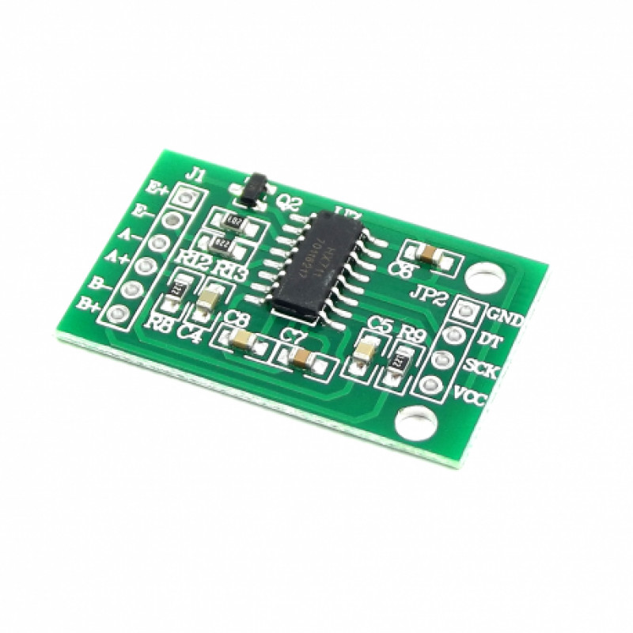

# Carolina Margiotti de Abreu

# Tabela de conteúdo
   - [Em 2020-1 (LittlePet) 1º Semestre](#em-2020-1-littlepet-1º-semestre)
        - [Empresa](#empresa)
        - [Problema](#problema)
        - [Solução](#solução)
            - [Hardware](#hardware)
            - [Software](#aplicativo-mobile)
        - [Tecnologias utilizadas](#tecnologias-utilizadas)
        - [Contribuições Pessoais](#contribuições-pessoais)
            - [Hard Skills](#hard-skills)
            - [Soft Skills](#soft-skills)

# Em 2020-1 (LittlePet) 1º Semestre

## Empresa

No primeiro semestre não se teve uma empresa, os projetos foram definidos pelas equipes.

## Problema

Os dispensadores automáticos de ração existentes hoje no mercado foram feitos para trabalhar com ração de cachorros e gatos, mas peca quando é usado com rações de outros pets muitas vezes mostra mal funcionamento entre outros inconvenientes. O projeto visa oferecer uma opção de dispensador de ração automático feito para ração de roedores, contendo inclusive a possibilidade de se programar quando a ração será dispensada.

## Solução

Nossa solução foi fazer dois projetos, um com Arduino para cuidar da parte física do dispensador e o segundo um aplicativo mobile para o agendamento de horários e notificacação. Nosso grupo continha 6 elementos no ínicio mas acabamos com apenas dois membros ativos no fim, eu atuando no time de desenvolvimento. 

### Hardware

O hardware foi feito por uma colega do grupo, nele foram utilizados:
- Uma balança de carga 5kg

Usado para calcular o peso de ração presente no dispensador, para mandar um aviso quando está vazio e precisa ser reenchido.

- Um motor 12V 15KGF

Responsável pelo movimento de girar para derrubar ração.

- WI-FI Lora 915MHZ

Se conecta ao banco para enviar dados novos.

- Placa Arduino Bluetooth

Se comunica com outros componentes sendo utilizados.

- Placa HX711

Converte os valores de peso da balança para dados digitais.

Segue imagem do projeto abaixo com alguns itens visíveis demarcados:

1. Motor
2. Placa Arduino
3. WI-FI Lora
4. Balança de carga
5. HX711

### Aplicativo Mobile

O aplicativo mobile eu fiz boa parte da codificação, com um outro membro auxiliando em certas partes dele.

Abaixo está a tela principal do aplicativo que será explicado de cima para baixo a seguir.

1. Um bloco informando qual usuário está conectado e o botão para deslogar o mesmo.
2. Um botão de seleção em que o usuário pode selecionar uma entre todas as conexões disponíveis ao redor.
3. Um texto informado se a conexão teve sucesso ou não.
4. A lista dos horários de dispensamento criados pelo usuário, quando não está informado quais os dias da semana o alarme será diariamente.
5. Botão para abrir um modal para seleção do horário para o agendamento (Aparece-se um texto embaixo informando qual o selecionado para confirmação).
6. Um array de botões, quando o usuário clica em um ele se torna verde informando que aquele dia será incluso na rotina para o horário selecionado do alarme.
7. Botão para confirmar a adição do horário novo.
8. Um texto adicionado para a etapa de desenvolvimento, informando onde o aparelho estava conectado, retirado na versão final.

#### Agendamento de horário
Programeni o agendamento de horários nos quais a ração seria dispensada do dispensador.

#### Conexão com arduino.
Fiz a programação para a conexão com o arduino.

#### Login
Programei a pagina de login.

#### Notificação
Fiz a programação da notificação do aplicativo, para identificar quando uma hora agendada chegou e soltar a notificação para o usuario.

## Tecnologias Utilizadas
- Kodular

Para a programação mobile.

- Arduino

Para o uso em hardware.

- Firebase

Banco de dados utilizado.

## Contribuições Pessoais
### Hard Skills
- Lógica de programação: 

Eu tinha uma lógica de construção já bem forte por conta do ensino técnico antes da faculdade, fui responsável pela lógica da agenda, programei grande parte dela.

- Banco de dados:

Já havia trabalhado com firebase antes no técnico, mas tive chance de poder aprender ele numa plataforma diferente da que estava acostumada e fiquei mais flexível com o uso dele.

- Kodular: 

Aprendi uma nova ferramenta para desenvolvimento mobile, anteriormente só tinha tido a chance de experimentar Android Studio, sendo uma ferramenta simples estou segura que se abrisse o kodular novamente poderia programar um aplicativo novamente sem grandes problemas.

### Soft Skills
- Liderança: 

Eu tive a ideia para o projeto e fui atrás de integrantes, falei da minha ideia para eles e aceitaram se juntando ao grupo.

- Comunicação e trabalho em equipe:

Me comuniquei bastante do que fazia e como estava meu trabalho com os outros integrantes, além de levantando dúvidas pertinentes e ajudando em dificuldades de outros.

