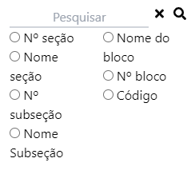
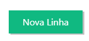
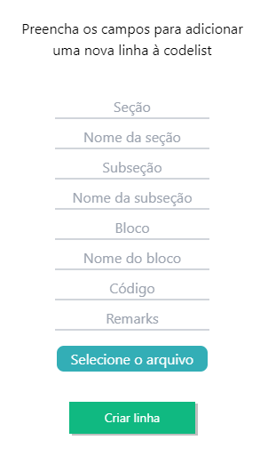
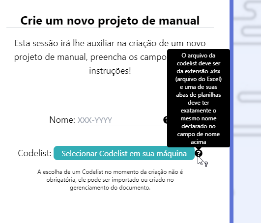
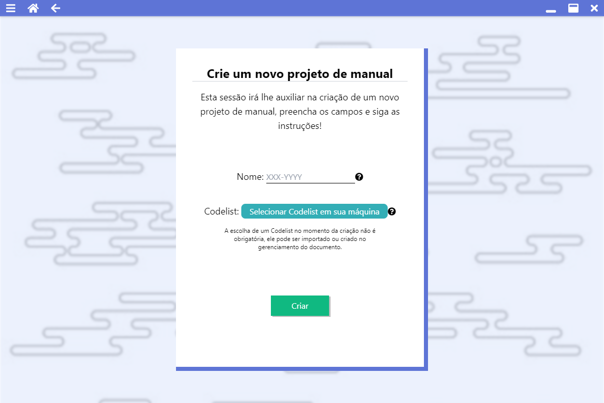
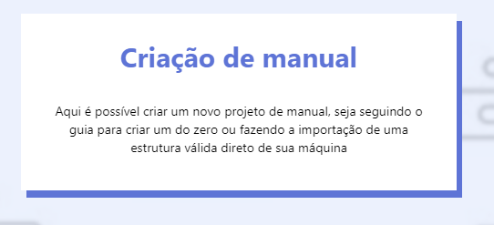

# Carolina Margiotti de Abreu

# Tabela de conteúdo

-   [Em 2021-1 (AirplaneDocGenerator) 4º Semestre](#em-2021-1-airplanedocgenerator-4º-semestre)
    -   [Empresa](#empresa)
    -   [Problema](#problema)
    -   [Solução](#solução)
        -   [Client](#client)
        -   [Server](#server)
    -   [Tecnologias utilizadas](#tecnologias-utilizadas)
    -   [Contribuições Pessoais](#contribuições-pessoais)
        -   [Hard Skills](#hard-skills)
        -   [Soft Skills](#soft-skills)

# Em 2021-2 (AirplaneDocGenerator) 4º Semestre

[Github AirplaneDocGenerator](https://github.com/CarolinaMargiotti/AirplaneDocGenerator)

## Empresa

Embraer é uma empresa da área aeroespacial, trabalhando na fabricação de aviões e peças aeroespaciais, além de oferecer outros tipos de suporte.

## Problema

Nosso cliente possui a necessidade de automatizar a geração de manuais para as suas aeronaves, pois, atualmente, o processo é feito de forma manual, o que pode tomar muito tempo em razão da complexidade para a montagem deles e, também, pode aumentar as chances de erros. Nossa aplicação tem como objetivo resolver esses problemas através de uma interface simples e intuitiva que agilizará o processo.

## Solução

   Foi criado dois projetos diferente, um server para o back-end responsavél pelos serviços e um client para front-end cuidando do que é visivel para o usuario.

### Client

Desenvolvido com electron, react e tailwind, permitia a visualização dos manuais e a interface de filtragem e criação deles.

#### Filtros

Eu programei os filtros para pesquisa e o sistema de filtrar dos manuais na pesquisa deles.

#### Criar nova linha

Os manuais eram formados por linhas que apontavam para uma pagina do manual, eu programei o botão e o modal para adicionar uma linha nova ao manual.

#### Tooltips

Criei o componente de tooltip e programei sua funcionalidade, permitindo fácil uso dele na programação para mostrar dicas e explicações de funcionalidades.

#### Pagina de criar manuais

Programei o esqueleto da pagina de criar manuais, embora não com as funcionalidades completas o visual estava 100% funcional e só foi necessário outro membro depois trocar os logs de console para o chamar da função que criaram para tal.

#### CardHeader

Um componente criado por mim, fica no topo de todas as paginas do sistema para explicar seu objetivo e mostrar o nome da pagina.

#### Criação do client

Eu criei a base do projeto de cliente, configurando o electron e react para o desenvolvimento.

#### Estrutura da seleção de projeto

Programei a estrutura base que um dos colegas usou para a pagina de seleção de projeto.

#### Ajustes menores

-   Consertei algumas paginas para o visual ficar mais parecido com o idealizado no figma.
-   Arrumei um bug na hora de criar o diretório onde ficaria os manuais quando baixados por um usuario.

### Server

#### Swagger

Swagger é uma ferramenta para documentação de APIs para agilizar o desenvolvimento. O configurei para o uso do projeto.

## Tecnologias Utilizadas

-   Electron.js \
    Para o desenvolvimento do aplicativo de desktop, utilizando linguagem de programação javascript.
-   React \
    Framework para agilizar desenvolvimento com javascript.
-   Tailwind CSS \
    Biblioteca de css para ajudar no desenvolvimento do front-end.
-   Spring Boot \
    Utilizado para o back-end, utilizando a linguagem de programação java.
-   PostgresSQL
    Banco de dados.

## Contribuições Pessoais

### Hard Skills

### Soft Skills
