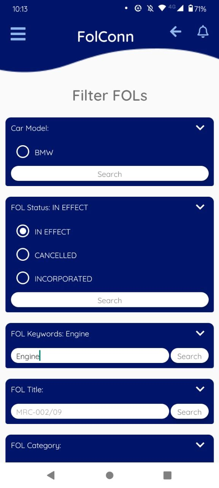
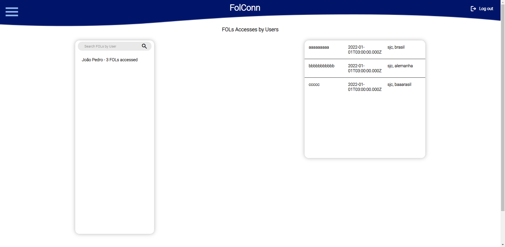

# Carolina Margiotti de Abreu

# Tabela de conteúdo

-   [Em 2022-1 (Folconn) 5º Semestre](#em-2022-1-folconn-5º-semestre)
    -   [Empresa](#empresa)
    -   [Problema](#problema)
    -   [Solução](#solução)
        -   [Client](#client)
        -   [Server](#server)
    -   [Tecnologias utilizadas](#tecnologias-utilizadas)
    -   [Contribuições Pessoais](#contribuições-pessoais)
        -   [Hard Skills](#hard-skills)
        -   [Soft Skills](#soft-skills)

# Em 2022-1 (Folconn) 5º Semestre
[Github Folconn](https://github.com/CarolinaMargiotti/api-claradb)

## Empresa

Embraer é uma empresa da área aeroespacial, trabalhando na fabricação de aviões e peças aeroespaciais, além de oferecer outros tipos de suporte.

## Problema

A empresa parceira fabrica diversos veículos, que são utilizados ao redor do mundo todo por todos os seus clientes. Algumas vezes, eles são fabricados e possuem algum problema, portanto, os compradores precisam ser informados para que não ocorra risco de vida ao utilizá-los. Atualmente a empresa parceira não possui nenhuma plataforma que centraliza todas as informações e notifica os usuários sobre recalls e avisos sobre possíveis avarias nos veículos fabricados. Sendo assim, nós, da equipe ClaraDB, fomos desafiados a desenvolver um aplicativo que comunica, através de notificações, os usuários sobre atualizações de possíveis transtornos nos veículos e automatiza a visualização do novo aviso.

## Solução

Foi feito 3 repositórios de códigos diferente, server cuidando dos serviços que são consumidos pelos outros 2, ClaraClient que é o cliente acessado pelo celular por aplicativo e AdminClient que é a página web para o administrador visualizar dados e estatísticas.

### Client

#### ClaraClient

##### Tela de filtro e pesquisa
Criado tela de filtro e pesquisa para fols.

    

##### Menu
Eu refatorei o componente de menu, ele tinha o problema antes de não flutuar em cima dos outros componentes e outras melhorias de qualidade de vida e código limpo.

### AdminClient

#### Fols por acesso de usuario
Criei a pagina para visualizar acessos de fol por cada usuario que autorizou ter o registro com seu nome.

    

### Server

#### Flask
Criei e configurei o ambiente de desenvolvimento com Python Flask.

#### Fols por acesso de usuario
Nessa tarefa eu criei dois endpoints novos, um para pegar do MongoDB todos os nomes de usuarios e um para pegar a lista de fols acessadas de um usuario especifico.

### Outras contribuições
#### LGPD
Eu fiz a pesquisa inicial sobre LGPD e como poderíamos aplica-la ao APP.

## Tecnologias Utilizadas
- React Native \
Uma biblioteca do React para desenvolvimento mobile.
- Python \
Linguagem de programação.
    - Flask \
Microframework web do Python, utilizado para as rotas de serviço.
- MongoDB \
Banco de dados NoSQL escolhido para armazenar os dados.

## Contribuições Pessoais

### Hard Skills
- React Native: Sei fazer com ajuda.
- Python, Flask: Sei fazer com autonomia.
- MongoDB: Sei fazer com autonomia.

### Soft Skills
- Trabalho em equipe

    Quando um membro da equipe começou a ter dificuldades com o menu me ofereci para ajuda-lo mesmo que adiasse um pouco minha tarefa, mas eu estava confiante que não teria problemas com ela então não fez mal.    

- Consciência Social

    Notei que os lideres da equipe estavam desenvolvendo muito rapido as tarefas por terem mais tempo livre e deixando nenhuma para o time de desenvolvimento assim.   Numa discussão sobre isso admitiram não confiar na gente e nos julgar injustamente pela nossa falta de tempo e dificuldades, tentei defender a equipe em frente a isso.

