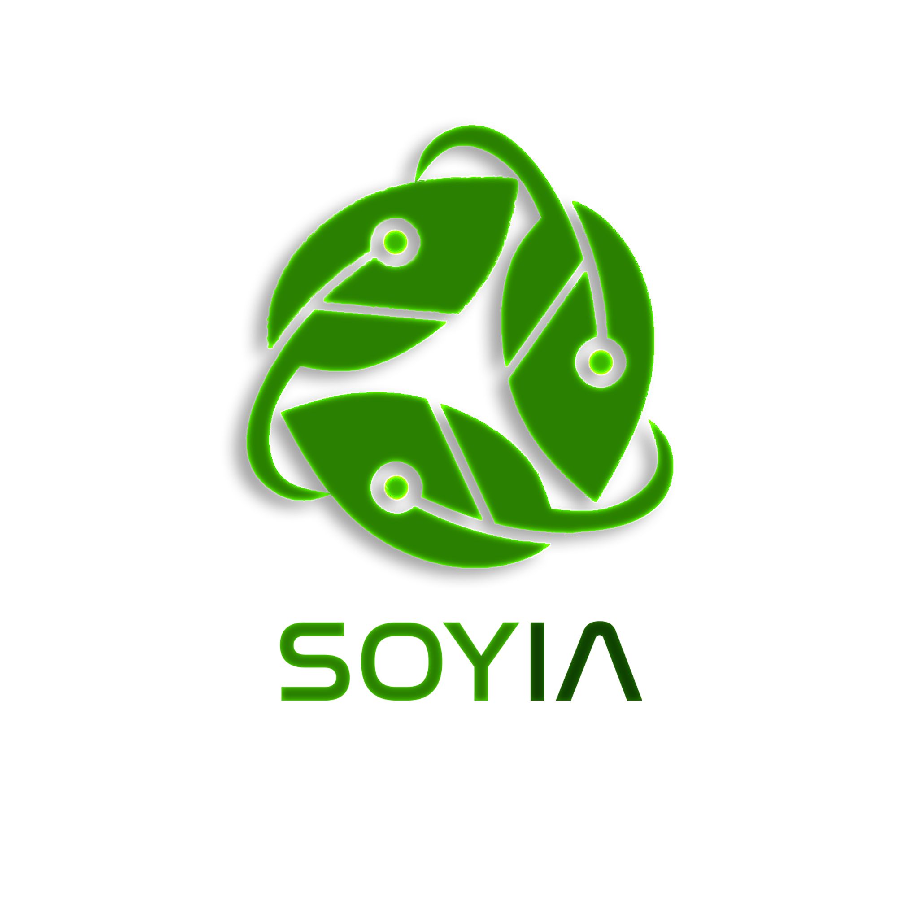
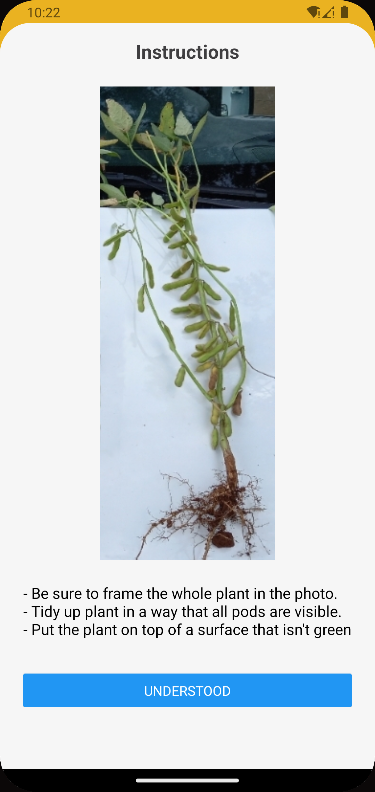
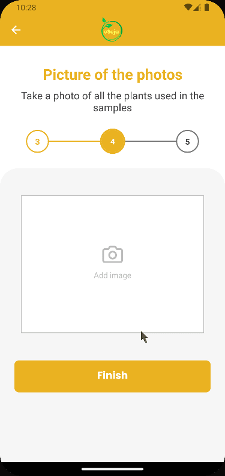
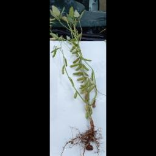

# Carolina Margiotti de Abreu

# Tabela de conteúdo

-   [Em 2022-2 (Soyia) 5º Semestre](#em-2022-2-soyia-6º-semestre)
    -   [Empresa](#empresa)
    -   [Problema](#problema)
    -   [Solução](#solução)
        -   [Client](#client)
        -   [Server](#server)
    -   [Tecnologias utilizadas](#tecnologias-utilizadas)
    -   [Contribuições Pessoais](#contribuições-pessoais)
        -   [Hard Skills](#hard-skills)
        -   [Soft Skills](#soft-skills)

# Em 2022-2 (Soyia) 6º Semestre

   

[Github Soyia](https://github.com/medrenan/SoyIA)

## Empresa

A Visiona é uma empresa de atividade espacial que oferece integrações de sistemas espaciais, oferecendo através dos dados de satélites que a Embraer coleta do INPE, soluções para as necessidades civis e militares do Brasil.

## Problema

A empresa parceira Visiona possui um aplicativo para registro e administração de cultivos de soja, nele o agricultor pode registrar suas plantas e receber estatísticas sobre sua plantação, mas para o registro de amostras era exigido que ele fosse a campo, colhesse três amostras e contasse manualmente cada vagem e sentimento dessas plantas para o preenchimento de dados no aplicativo, isso levava em torno de 15 minutos para o agricultor e tornava o uso do aplicativo não tão conveniente. Vendo uma oportunidade de melhoria nesse aspecto, a Visiona veio a nós pedir para criar uma nova funcionalidade para a aplicação: Uma inteligência artificial que dava uma estimativa das vagens e sementes por planta apartir de uma foto da mesma, facilitando e agilizando seu trabalho.

## Solução

Foi feito fork dos repositórios de front e back-end do aplicativo original para facilitar o desenvolvimento das nossas mudanças e também foi criado um segundo back-end para isolar as funcionalides de IA.

### Client

#### ESoja Mobile

##### Reordenação das telas
As telas de criar cadastro já continha uma funcionalidade para salvamento de imagem, ela foi reaproveitada para permitir o usuário informar a imagem que deseja usar para calcular o número de sementes, isso exigiu uma refatoração das telas pela bagunça na navegação e transferência de dados entre telas.

##### Modal de instruções
Criei modal com instruções de como tirar a imagem para facilitar a relação usuário e inteligência artificial.

   

##### Integração api
Criamos nossa própria api para isolar os endpoints da IA do restante do aplicativo, fui responsável pela integração.

##### Atribuição automatica
Programei para os dados recebidos pela api da contagem de sementes ser atribuída automaticamente nos campos.

    
##### Conserto de bugs do aplicativo
O aplicativo original continha vários bugs que não foram resolvidos pela falta de tempo, não só no front mas no back também, resolvi os seguintes do front durante o desenvolvimento da nossa funcionalidade:
- Bug que o datepicker não pegava a data inserida.
- Bug que causava erro ao tentar criar uma amostra.

##### Infraestrutura
Tivemos muitos problemas para fazer o aplicativo rodar pela falta de documentação, os que analisei e ajustei para a equipe no front são:
- Descobri como configurar o emulador do Android Studio para rodar as mudanças locais para o desenvolvimento.
- Descobri que precisava por os ips da máquina local no arquivo de api para o aplicativo no emulador mobile encontrar o servidor.

### Server

#### Esoja-api
##### Conserto de bug
O aplicativo original continha vários bugs que não foram resolvidos pela falta de tempo, não só no front mas no back também, resolvi os seguintes do back durante o desenvolvimento da nossa funcionalidade:
Consertei um bug que causava erro ao criar uma propriedade.

#### Soyia-api

##### Estruturar o projeto em flask
Criei um projeto em flask para colocarmos nossos endpoints da IA.

##### Resize e padding de imagem
O script foi criado para auxiliar a IA por IAs ter uma eficiência maior quando todas as imagens têm o mesmo tamanho.
Resultado de um padding e resize:

   

##### Infraestrutura
Tivemos muitos problemas para fazer o aplicativo rodar pela falta de documentação, os que analisei e ajustei para a equipe no back são:
- Consertei o arquivo env para conseguir levantar o docker.
- Descobri que ja ter um postgres instalado localmente no sistema confundia o servidor.
- Criei um script para fazer o servidor abrir adequadamente.
- Descobri quais eram as urls de request e como chama-las.
- Descobri como fazer autenticação para adquirir o token para os requests avançados.
- Configurei o firebase para conseguirmos armazenarmos as imagens.

## Tecnologias Utilizadas
- React Native \
Uma biblioteca do React para desenvolvimento mobile.
- Typescript \
Superset do javascript.
- Python \
Linguagem de programação.
    - Flask \
Microframework web do Python, utilizado para as rotas de serviço.
- Firebase \
Banco de dados NoSQL escolhido para armazenar as imagens.
- Node.js \
Software open source para ambiente de server.
- Prisma \
Um ORM para typescript e node.js.
- Docker \
Virtualização de nível de sistema operacional para uso de contêineres.

## Contribuições Pessoais

### Hard Skills
- React Native: Sei fazer com certa autonomia.
- Python, Flask: Sei fazer com autonomia.
- Node.js: Sei fazer com autonomia.
- Typescript: Sei fazer com autonomia.
- Docker: Sei usar com ajuda.
- Prisma: Ouvi falar.

### Soft Skills
- Organização \
Mantive o nosso site de escolha de gerenciamento de projeto atualizado e todas as tarefas devidamente acompanhadas quando os outros membros se esqueciam de o atualizar.

- Scrum \
Durante as sprints relembrava a equipe e cobrava de fazer dailies e sprint reviews e retrospectives para mantermos todos informados e animados com o projeto.

- Problem Solving \
Como falado no desenvolvimento, eu resolvi os problemas de infraestrutura que encontramos durante o desenvolvimento, e é uma área que não conheço bem então foi um desafio grande para mim, mas com analise e estudo foram resolvidos eventualmente por mim.
