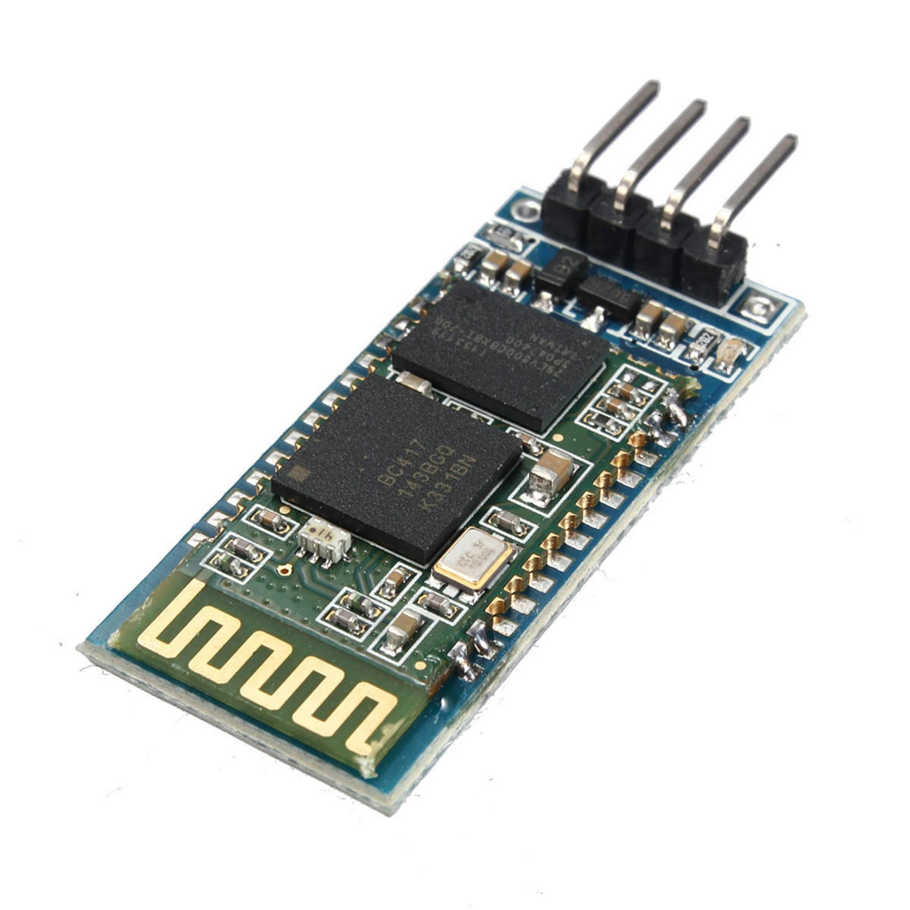
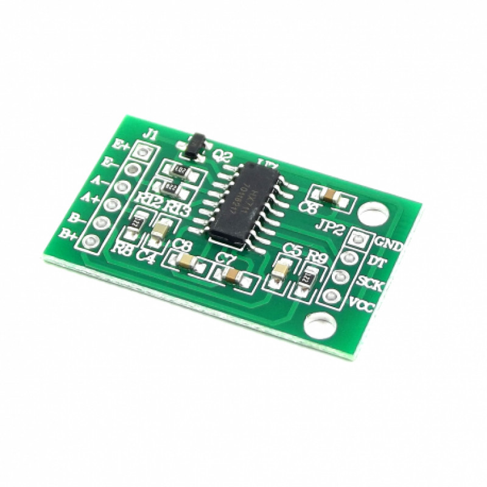

# Carolina Margiotti de Abreu

# Introdução
(foto a por)

## Escolaridade
Em 2017 eu me matriculei no curso técnico de informática no colégio Univap Unidade Centro e foi lá onde tive meu primeiro contato com programação, durante os três anos aprendi desde o básico com variáveis, estruturas de repetição até POO e computação gráfica. La tive um aprendizado bem sólido com inúmeras listas para entendermos bem o básico e sou bem grata por isso. No último ano fiz uma apresentação do TCC em que eu codifiquei sozinha um site de bookmarks e anotações com tema planetário e fui aprovada com sucesso.

Após me formar do colégio Univap em 2019 iniciei meus estudos na Fatec em 2020 para amadurecer mais meu conhecimento e aprender o que o técnico não teve tempo de me ensinar. Os primeiros semestres foram para mim uma revisão do que eu já tinha visto de programação na Univap mas pude experimentar também tecnologias e linguagens novas que não tinha visto ainda, bem como o modelo de projetos API, (Aprendizado Projeto Integrador) em que todo semestre nós em grupos trabalhamos em uma aplicação para resolver problemas de clientes reais (Empresas em associação com a Fatec), que me ajudou a desenvolver mais minhas soft skills e explorar os meios de organização de projeto e trabalho em grupo usados na área.

No segundo ano de estudos eu pude começar a ver conteúdo novo de verdade e utilizar melhor de meu conhecimento antigo e novo para a realização de projetos, e me sentir mais segura e profissional neles.

## Experiência Profissional
Comecei com meu primeiro estágio (ele sendo para minha formação do técnico de informática) em julho de 2019 na PRTi Digital, a empresa trabalhava com RPA (Robotic Proccess Automation) onde utilizava as tecnologias Automation Anywhere e UIPath para a programação de robôs para efetuar processos repetitivos e maçantes no lugar de seres humanos, salvando tempo para as empresas por eles serem mais rápidos e ter uma taxa de erro quase nula. Participei de três grandes entregas de robô para a empresa onde eu fui bem responsável pela codificação, sendo a que mais mostrou resultados com o treinamento e com a empresa não tendo muito programadores RPA ainda na época. Embora eu usasse bastante lógica de programação e as vezes programação em si (UIPath tinha campos em que você codificava em C#) eu ainda queria ter a experiencia com trabalhar em uma aplicação de verdade o que me levou ao meu segundo estágio.

Em 2021 sai da PRTi Digital eu comecei meu estágio na SOLUCX (agora com o estágio valendo para a faculdade), uma empresa que trabalha com pesquisas de satisfação de serviços para inúmeras empresas pelo brasil. Trabalhando lá já consegui níveis altos de experiencia e conhecimento novo, mexi com ferramentas e frameworks novos que não tinha visto nada parecido em sala ainda, experienciei SCRUM como ele realmente é para ser feito, aprendi sobre testes unitários e outros times envolvidos no desenvolvimento de uma aplicação como o de Quality Assurance que nunca ouvirá até o momento. Ainda estou lá até o momento e ainda estou aprendendo muito e tendo oportunidades de me desafiar.

# Meus Projetos

## Em 2020-1 (LittlePet) 1º Semestre

### Empresa
As Fatecs são instituições importantes para o Brasil em ensino superior, sendo pioneiras na graduação de tecnólogos e localizadas em vÁrias cidades pelo estado de São Paulo. A unidade de São José dos Campos oferece um grande número de cursos para graduação de nível superior neles incluindo analise e desenvolvimento de sistemas, Banco de dados, manutenção de aeronaves entre outros.

Em 2020 foi iniciado o projeto integrador na Fatec, em que a faculdade fazia parceria com empresas para realizar um projeto em conjunto, os alunos recebiam o problema das empresas e elaboram uma solução que é apresentada em sprints e no fim há uma feira de soluções com cada grupo de alunos apresentando seus projetos.

No primeiro semestre os alunos decidem um próprio problema para resolver no decorrer do semestre.

### Problema
Os dispensadores automáticos de ração existentes hoje em dia no mercado foram feitos para trabalhar com ração de cachorros e gatos principalmente, um trabalho no qual ele faz muito bem, mas peca quando é usado com outros tipos de ração tipo o de roedores que é normalmente encontrado no formato cilíndrico, que muitas vezes empaca no dispensador entre outros inconvenientes. O projeto virava oferecer uma opção de dispensador de ração automático feito para roedores, contendo inclusive a possibilidade de se programar quando a ração será dispensada.

### Solução
Nossa solução foi fazer dois projetos, um com Arduino para cuidar da parte física do dispensador e o segundo um aplicativo mobile que cuidou da parte de agendamento prático dos dispensamentos de ração.

#### Hardware

No hardware foram utilizados:
- Uma balança de carga 5kg

Usado para calcular o peso de ração presente no dispensador, para mandar um aviso quando está vazio e precisa ser reenchido.

- Um motor 12V 15KGF

Responsável pelo movimento de girar para derrubar ração.

- WI-FI Lora 915MHZ

Se conecta ao banco para enviar dados novos.

- Placa Arduino Bluetooth

Se comunica com outros componentes sendo utilizados.

- Placa HX711

Converte os valores de peso da balança para dados digitais.

Segue imagem do projeto abaixo com alguns itens visíveis demarcados:

1. Motor
2. Placa Arduino
3. WI-FI Lora
4. Balança de carga
5. HX711

#### Aplicativo Mobile

Abaixo está a tela principal do aplicativo que será explicado de cima para baixo a seguir.

1. Um bloco informando qual usuário está conectado e o botão para deslogar o mesmo.
2. Um botão de seleção em que o usuário pode selecionar uma entre todas as conexões disponíveis ao redor.
3. Um texto informado se a conexão teve sucesso ou não.
4. A lista dos horários de dispensamento criados pelo usuário, quando não está informado quais os dias da semana o alarme será diariamente.
5. Botão para abrir um modal para seleção do horário para o agendamento (Aparece-se um texto embaixo informando qual o selecionado para confirmação).
6. Um array de botões, quando o usuário clica em um ele se torna verde informando que aquele dia será incluso na rotina para o horário selecionado do alarme.
7. Botão para confirmar a adição do horário novo.
8. Um texto adicionado para a etapa de desenvolvimento, informando onde o aparelho estava conectado, retirado na versão final.

#### Tecnologias Utilizadas
- Kodular

- Arduino

- Firebase

### Contribuições Pessoais
#### Hard Skills
- Lógica de programação: Eu tinha uma lógica de construção já bem forte por conta do ensino técnico antes da faculdade, fui responsável pela lógica da agenda, programei grande parte dela.
- Banco de dados: Já havia mexido com firebase antes no técnico, mas tive chance de poder aprender ele numa plataforma diferente da que estava acostumada e fiquei mais flexível com o uso dele.
- Kodular: Aprendi uma nova ferramenta para desenvolvimento mobile, anteriormente só tinha tido a chance de experimentar Android Studio, sendo uma ferramenta simples estou segura que se abrisse novamente poderia programar um aplicativo novamente sem grandes problemas.

#### Soft Skills
- Liderança: Eu tive a ideia para o projeto e fui atrás de integrantes, falei da minha ideia para eles e aceitaram se juntando ao grupo.
- Comunicação e trabalho em equipe: Me comuniquei bastante do que fazia e como estava meu trabalho com os outros integrantes, além de levantando dúvidas pertinentes e ajudando em dificuldades de outros.

